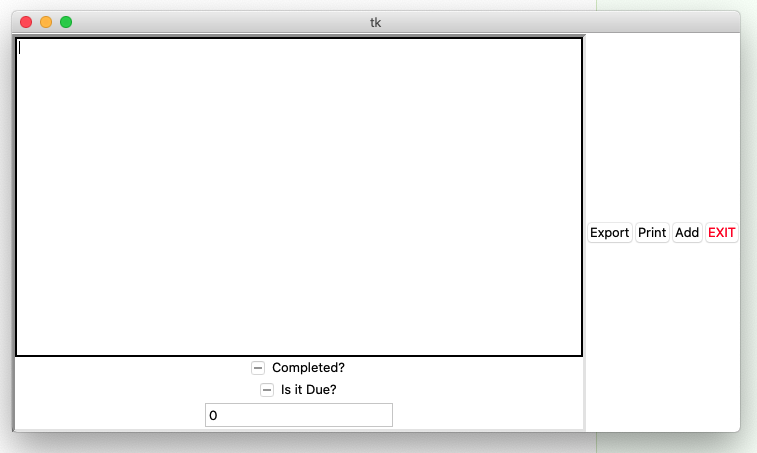

# todo
A TODO list program built with Python

Work in progress!

## Notes

I built this during a slow and boring day at work in 2020. God bless.

* My first time using tkinter to build a Python-based GUI program
* Been meaning to make a TODO program for quite a while now and am finally doing it
* Figuring out what I want it to do/look like as I go

## Current State

